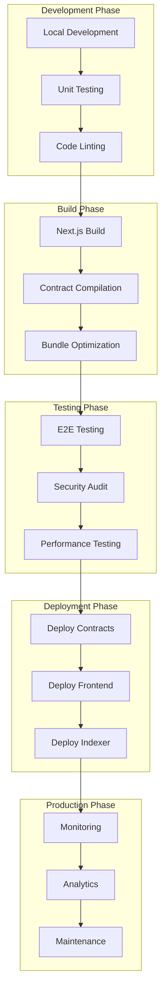
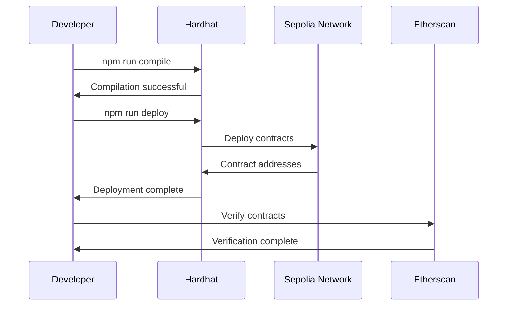
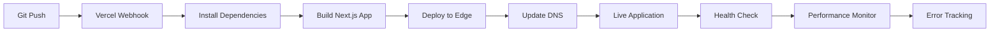
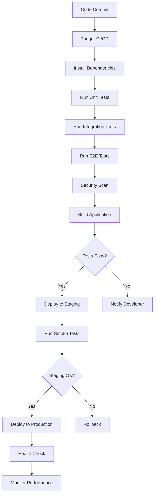

# 🚀 MetaArmy Deployment Guide

## 📋 **Deployment Workflow Overview**



---

## 🏗️ **Infrastructure Setup**

### **1. Prerequisites**
```bash
# Required Software
Node.js 18+
npm or yarn
Git
MetaMask Browser Extension

# Required Accounts
GitHub Account
Vercel Account
Alchemy/Infura Account
Etherscan Account
Google Cloud Account (for Gemini AI)
```

### **2. Environment Configuration**
```bash
# Clone Repository
git clone https://github.com/your-username/meta-army.git
cd Meta-Plot-AI

# Install Dependencies
npm install --legacy-peer-deps

# Setup Environment Variables
cp .env.example .env.local
```

### **3. Environment Variables Setup**
```bash
# .env.local Configuration

# =============================================================================
# PUBLIC CONFIGURATION (Safe for frontend)
# =============================================================================
NEXT_PUBLIC_WALLETCONNECT_PROJECT_ID=your_walletconnect_project_id
NEXT_PUBLIC_META_PLOT_AGENT_ADDRESS=0xcf4F105FeAc23F00489a7De060D34959f8796dd0
NEXT_PUBLIC_DAO_ADDRESS=0x464D37393C8D3991b493DBb57F5f3b8c31c7Fa60
NEXT_PUBLIC_ARMY_TOKEN_ADDRESS=0x5d946da55953d7AA3d2BfB5Bd43B77bfD8e502DE
NEXT_PUBLIC_NETWORK=sepolia

# =============================================================================
# PRIVATE CONFIGURATION (Server-side only)
# =============================================================================
ETHERSCAN_API_KEY=your_etherscan_api_key
GEMINI_API_KEY=your_gemini_api_key
SEPOLIA_RPC_URL=https://sepolia.infura.io/v3/your_project_id
ALCHEMY_API_KEY=your_alchemy_api_key
```

---

## 📜 **Smart Contract Deployment**

### **1. Contract Compilation**
```bash
# Compile Smart Contracts
npm run compile

# Run Tests
npm run test

# Check Coverage
npm run coverage
```

### **2. Testnet Deployment**
```bash
# Deploy to Sepolia Testnet
npm run deploy

# Verify Contracts on Etherscan
npx hardhat verify --network sepolia CONTRACT_ADDRESS

# Update Frontend Configuration
# Copy deployed addresses to .env.local
```

### **3. Contract Verification Workflow**


---

## 🌐 **Frontend Deployment**

### **1. Vercel Deployment Setup**
```bash
# Install Vercel CLI
npm install -g vercel

# Login to Vercel
vercel login

# Deploy to Production
vercel --prod
```

### **2. Vercel Configuration**
```json
// vercel.json
{
  "framework": "nextjs",
  "buildCommand": "npm run build",
  "installCommand": "npm install --legacy-peer-deps",
  "functions": {
    "app/**/*.ts": {
      "maxDuration": 30
    }
  },
  "ignoreCommand": "git diff --quiet HEAD^ HEAD ./app ./public ./package.json"
}
```

### **3. Environment Variables in Vercel**
```bash
# Vercel Dashboard → Project Settings → Environment Variables

# Production Environment Variables
ETHERSCAN_API_KEY=your_production_etherscan_key
GEMINI_API_KEY=your_production_gemini_key
SEPOLIA_RPC_URL=your_production_rpc_url

# Public Variables (automatically prefixed)
NEXT_PUBLIC_WALLETCONNECT_PROJECT_ID=your_project_id
NEXT_PUBLIC_META_PLOT_AGENT_ADDRESS=0x...
NEXT_PUBLIC_NETWORK=sepolia
```

### **4. Deployment Workflow**


---

## 📊 **Monitoring & Analytics Setup**

### **1. Application Monitoring**
```typescript
// Vercel Analytics Integration
import { Analytics } from '@vercel/analytics/react'

export default function App({ Component, pageProps }) {
  return (
    <>
      <Component {...pageProps} />
      <Analytics />
    </>
  )
}

// Custom Error Tracking
const errorTracker = {
  captureException: (error: Error) => {
    console.error('Application Error:', error)
    // Send to monitoring service
  },
  
  captureMessage: (message: string, level: 'info' | 'warning' | 'error') => {
    console.log(`[${level.toUpperCase()}] ${message}`)
    // Send to monitoring service
  }
}
```

### **2. Performance Monitoring**
```typescript
// Web Vitals Tracking
import { getCLS, getFID, getFCP, getLCP, getTTFB } from 'web-vitals'

const sendToAnalytics = (metric) => {
  // Send metrics to analytics service
  console.log(metric)
}

getCLS(sendToAnalytics)
getFID(sendToAnalytics)
getFCP(sendToAnalytics)
getLCP(sendToAnalytics)
getTTFB(sendToAnalytics)
```

### **3. Blockchain Monitoring**
```typescript
// Contract Event Monitoring
const monitorContractEvents = () => {
  const contract = new ethers.Contract(address, abi, provider)
  
  contract.on('SwarmExecuted', (swarmId, success, event) => {
    console.log('Swarm Executed:', { swarmId, success })
    
    // Track execution metrics
    trackMetric('swarm_execution', {
      swarmId,
      success,
      gasUsed: event.gasUsed,
      timestamp: Date.now()
    })
  })
  
  contract.on('PermissionGranted', (permissionId, user, event) => {
    console.log('Permission Granted:', { permissionId, user })
    
    // Track permission metrics
    trackMetric('permission_granted', {
      permissionId,
      user,
      timestamp: Date.now()
    })
  })
}
```

---

## 🔄 **CI/CD Pipeline**

### **1. GitHub Actions Workflow**
```yaml
# .github/workflows/deploy.yml
name: Deploy MetaArmy

on:
  push:
    branches: [main]
  pull_request:
    branches: [main]

jobs:
  test:
    runs-on: ubuntu-latest
    steps:
      - uses: actions/checkout@v3
      - uses: actions/setup-node@v3
        with:
          node-version: '18'
      
      - name: Install dependencies
        run: npm install --legacy-peer-deps
      
      - name: Run tests
        run: npm run test
      
      - name: Run linting
        run: npm run lint
      
      - name: Build application
        run: npm run build

  deploy:
    needs: test
    runs-on: ubuntu-latest
    if: github.ref == 'refs/heads/main'
    steps:
      - uses: actions/checkout@v3
      
      - name: Deploy to Vercel
        uses: amondnet/vercel-action@v20
        with:
          vercel-token: ${{ secrets.VERCEL_TOKEN }}
          vercel-org-id: ${{ secrets.ORG_ID }}
          vercel-project-id: ${{ secrets.PROJECT_ID }}
          vercel-args: '--prod'
```

### **2. Automated Testing Pipeline**


### **3. Quality Gates**
```typescript
// Jest Configuration
module.exports = {
  testEnvironment: 'jsdom',
  setupFilesAfterEnv: ['<rootDir>/jest.setup.js'],
  testPathIgnorePatterns: ['<rootDir>/.next/', '<rootDir>/node_modules/'],
  collectCoverageFrom: [
    'app/**/*.{js,jsx,ts,tsx}',
    '!app/**/*.d.ts',
    '!app/**/index.{js,ts}',
  ],
  coverageThreshold: {
    global: {
      branches: 80,
      functions: 80,
      lines: 80,
      statements: 80,
    },
  },
}

// ESLint Configuration
module.exports = {
  extends: [
    'next/core-web-vitals',
    '@typescript-eslint/recommended',
    'prettier',
  ],
  rules: {
    '@typescript-eslint/no-unused-vars': 'error',
    '@typescript-eslint/no-explicit-any': 'warn',
    'prefer-const': 'error',
    'no-console': 'warn',
  },
}
```

---

## 🔐 **Security Deployment**

### **1. Security Checklist**
```bash
# Pre-deployment Security Audit
□ Smart contract audit completed
□ Frontend security scan passed
□ Environment variables secured
□ API keys rotated
□ Access controls verified
□ Rate limiting implemented
□ CORS configured properly
□ CSP headers set
□ HTTPS enforced
□ Input validation implemented
```

### **2. Security Headers Configuration**
```typescript
// next.config.js Security Headers
const securityHeaders = [
  {
    key: 'X-DNS-Prefetch-Control',
    value: 'on'
  },
  {
    key: 'Strict-Transport-Security',
    value: 'max-age=63072000; includeSubDomains; preload'
  },
  {
    key: 'X-XSS-Protection',
    value: '1; mode=block'
  },
  {
    key: 'X-Frame-Options',
    value: 'DENY'
  },
  {
    key: 'X-Content-Type-Options',
    value: 'nosniff'
  },
  {
    key: 'Referrer-Policy',
    value: 'origin-when-cross-origin'
  }
]

module.exports = {
  async headers() {
    return [
      {
        source: '/(.*)',
        headers: securityHeaders,
      },
    ]
  },
}
```

### **3. Environment Security**
```bash
# Production Environment Security

# 1. Separate environments
DEVELOPMENT_ENV=development
STAGING_ENV=staging
PRODUCTION_ENV=production

# 2. Key rotation schedule
API_KEY_ROTATION_DAYS=90
SECRET_ROTATION_DAYS=30

# 3. Access control
ADMIN_WHITELIST=admin1@company.com,admin2@company.com
DEPLOYMENT_APPROVAL_REQUIRED=true

# 4. Monitoring
SECURITY_ALERTS_ENABLED=true
ANOMALY_DETECTION_ENABLED=true
```

---

## 📈 **Performance Optimization**

### **1. Build Optimization**
```typescript
// next.config.js Performance Configuration
module.exports = {
  // Enable SWC minification
  swcMinify: true,
  
  // Optimize images
  images: {
    domains: ['example.com'],
    formats: ['image/webp', 'image/avif'],
  },
  
  // Bundle analyzer
  webpack: (config, { isServer }) => {
    if (process.env.ANALYZE === 'true') {
      const { BundleAnalyzerPlugin } = require('webpack-bundle-analyzer')
      config.plugins.push(
        new BundleAnalyzerPlugin({
          analyzerMode: 'server',
          openAnalyzer: true,
        })
      )
    }
    return config
  },
  
  // Experimental features
  experimental: {
    optimizeCss: true,
    optimizePackageImports: ['lucide-react'],
  },
}
```

### **2. Runtime Performance**
```typescript
// Performance Monitoring
const performanceObserver = new PerformanceObserver((list) => {
  for (const entry of list.getEntries()) {
    if (entry.entryType === 'navigation') {
      console.log('Page Load Time:', entry.loadEventEnd - entry.loadEventStart)
    }
    
    if (entry.entryType === 'measure') {
      console.log('Custom Metric:', entry.name, entry.duration)
    }
  }
})

performanceObserver.observe({ entryTypes: ['navigation', 'measure'] })

// Custom Performance Metrics
const measureAsyncOperation = async (name: string, operation: () => Promise<any>) => {
  performance.mark(`${name}-start`)
  const result = await operation()
  performance.mark(`${name}-end`)
  performance.measure(name, `${name}-start`, `${name}-end`)
  return result
}
```

---

## 🚨 **Troubleshooting Guide**

### **Common Deployment Issues**

#### **1. Build Failures**
```bash
# Issue: TypeScript compilation errors
# Solution: Fix type errors and update dependencies
npm run lint
npm run type-check

# Issue: Memory issues during build
# Solution: Increase Node.js memory limit
NODE_OPTIONS="--max-old-space-size=4096" npm run build

# Issue: Dependency conflicts
# Solution: Use legacy peer deps
npm install --legacy-peer-deps
```

#### **2. Runtime Errors**
```bash
# Issue: Environment variables not loaded
# Solution: Check Vercel environment variable configuration
vercel env ls

# Issue: API rate limiting
# Solution: Implement exponential backoff
const retryWithBackoff = async (fn, retries = 3) => {
  try {
    return await fn()
  } catch (error) {
    if (retries > 0 && error.status === 429) {
      await new Promise(resolve => setTimeout(resolve, 1000 * (4 - retries)))
      return retryWithBackoff(fn, retries - 1)
    }
    throw error
  }
}
```

#### **3. Performance Issues**
```bash
# Issue: Slow page loads
# Solution: Implement code splitting and lazy loading
const LazyComponent = lazy(() => import('./HeavyComponent'))

# Issue: Large bundle size
# Solution: Analyze and optimize bundle
npm run analyze
npm run build -- --analyze

# Issue: Memory leaks
# Solution: Implement proper cleanup
useEffect(() => {
  const subscription = subscribe()
  return () => subscription.unsubscribe()
}, [])
```

---

## 📊 **Deployment Metrics**

### **Key Performance Indicators**
```typescript
interface DeploymentMetrics {
  buildTime: number          // Build duration in seconds
  bundleSize: number         // Bundle size in MB
  loadTime: number          // Initial page load time
  errorRate: number         // Error rate percentage
  uptime: number           // Uptime percentage
  responseTime: number     // Average API response time
}

const trackDeploymentMetrics = (metrics: DeploymentMetrics) => {
  console.log('Deployment Metrics:', metrics)
  
  // Send to analytics service
  analytics.track('deployment_complete', metrics)
  
  // Alert if metrics exceed thresholds
  if (metrics.errorRate > 1) {
    alert('High error rate detected')
  }
  
  if (metrics.loadTime > 3000) {
    alert('Slow page load detected')
  }
}
```

### **Success Criteria**
- ✅ Build completes in < 5 minutes
- ✅ Bundle size < 2MB
- ✅ Page load time < 3 seconds
- ✅ Error rate < 1%
- ✅ Uptime > 99.9%
- ✅ API response time < 500ms

---

This deployment guide provides a comprehensive workflow for deploying MetaArmy to production with proper monitoring, security, and performance optimization.