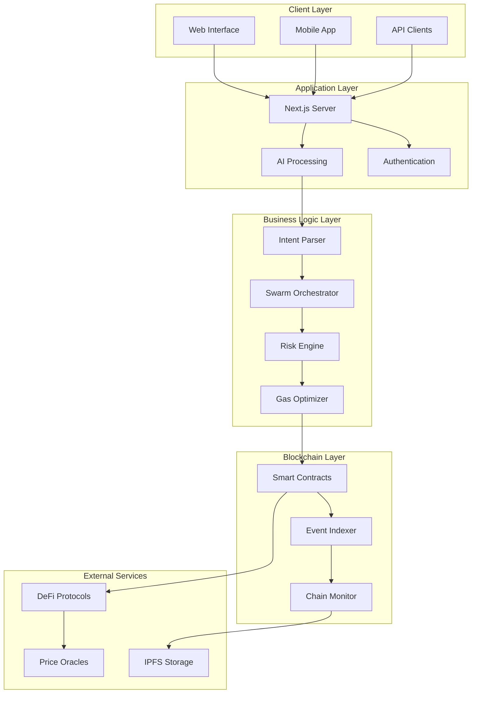
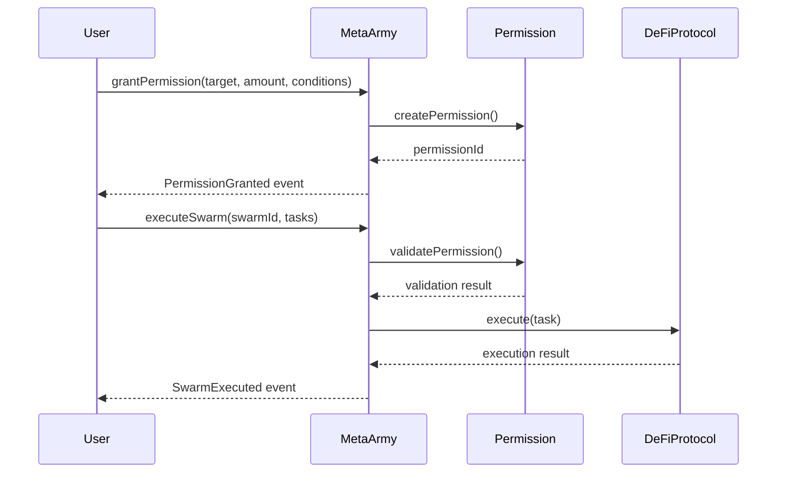
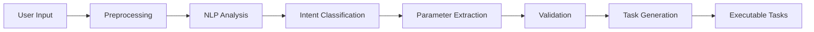
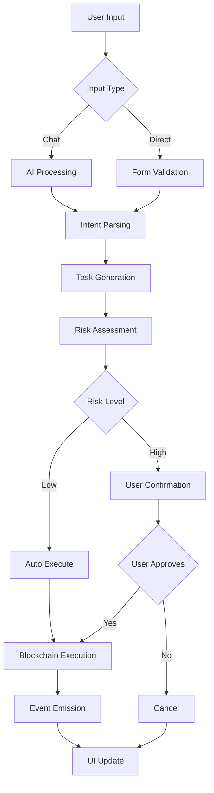
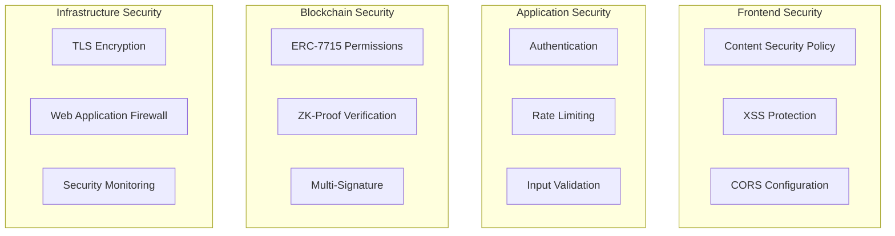

# 🔧 MetaArmy Technical Documentation

## 📋 **Table of Contents**
1. [System Architecture](#system-architecture)
2. [Smart Contract Design](#smart-contract-design)
3. [AI Integration](#ai-integration)
4. [Frontend Architecture](#frontend-architecture)
5. [Data Flow](#data-flow)
6. [Security Model](#security-model)
7. [Performance Optimization](#performance-optimization)
8. [API Reference](#api-reference)

---

## 🏗️ **System Architecture**

### **High-Level Architecture**


### **Component Breakdown**

#### **Frontend Components**
- **ChatInterface**: Natural language input processing
- **Dashboard**: Portfolio overview and analytics
- **SwarmMarketplace**: Browse and deploy automation strategies
- **GovernancePortal**: DAO voting and proposals
- **ArmyConfiguration**: User preferences and risk settings

#### **Backend Services**
- **Intent Parser**: Converts natural language to executable tasks
- **Swarm Orchestrator**: Coordinates multi-step operations
- **Risk Engine**: Evaluates and mitigates execution risks
- **Gas Optimizer**: Minimizes transaction costs

---

## 📜 **Smart Contract Design**

### **MetaArmy Core Contract**
```solidity
contract MetaArmy {
    // ERC-7715 Permission Management
    mapping(bytes32 => Permission) public permissions;
    mapping(address => bytes32[]) public userPermissions;
    
    // Swarm Execution Engine
    mapping(bytes32 => SwarmBundle) public swarmBundles;
    mapping(address => uint256) public executionNonce;
    
    // Events
    event PermissionGranted(bytes32 indexed permissionId, address indexed user);
    event SwarmExecuted(bytes32 indexed swarmId, bool success);
    event AgentDeployed(address indexed agent, string strategy);
}
```

### **Permission Structure**
```solidity
struct Permission {
    address user;           // Permission owner
    address target;         // Target contract
    uint256 amount;         // Maximum amount
    uint256 expiry;         // Expiration timestamp
    bytes conditions;       // Execution conditions
    bool active;           // Permission status
    uint256 totalExecuted; // Amount already used
}
```

### **Swarm Bundle Structure**
```solidity
struct SwarmBundle {
    bytes32 id;            // Unique identifier
    address creator;       // Bundle creator
    Task[] tasks;          // Execution tasks
    uint256 gasLimit;      // Maximum gas
    bool requiresZK;       // ZK-proof requirement
    uint256 created;       // Creation timestamp
}
```

### **Contract Interaction Flow**


---

## 🧠 **AI Integration**

### **Intent Processing Pipeline**


### **Gemini AI Integration**
```typescript
interface AIParser {
  parseIntent(input: string): Promise<SwarmIntent>
  validateTasks(tasks: Task[]): Promise<ValidationResult>
  optimizeExecution(tasks: Task[]): Promise<OptimizedTasks>
}

class GeminiAIParser implements AIParser {
  async parseIntent(input: string): Promise<SwarmIntent> {
    const prompt = this.buildPrompt(input)
    const response = await this.geminiClient.generateContent(prompt)
    return this.parseResponse(response)
  }
}
```

### **Intent Classification**
- **Investment**: "invest", "stake", "lend", "deposit"
- **Trading**: "swap", "trade", "exchange", "buy", "sell"
- **Yield**: "yield", "farm", "earn", "compound"
- **Governance**: "vote", "propose", "delegate"
- **Portfolio**: "rebalance", "diversify", "allocate"

### **Parameter Extraction**
```typescript
interface ExtractedParams {
  amount: string          // "100", "0.5", "all"
  asset: string          // "USDC", "ETH", "DAI"
  protocol: string       // "Aave", "Uniswap", "Lido"
  conditions: string[]   // ["gas < 30 gwei", "APY > 5%"]
  timeframe: string      // "immediate", "1 hour", "daily"
}
```

---

## 🎨 **Frontend Architecture**

### **Component Hierarchy**
```
App
├── Layout
│   ├── Header
│   │   ├── SearchSystem
│   │   ├── NotificationCenter
│   │   └── WalletConnect
│   ├── Sidebar
│   └── Main
│       ├── Dashboard
│       ├── ChatInterface
│       ├── SwarmMarketplace
│       ├── GovernancePortal
│       └── ArmyConfiguration
└── Providers
    ├── WagmiProvider
    ├── QueryProvider
    └── ThemeProvider
```

### **State Management**
```typescript
// Global State with Zustand
interface AppState {
  activeTab: TabType
  user: UserProfile
  swarms: SwarmBundle[]
  notifications: Notification[]
  
  // Actions
  setActiveTab: (tab: TabType) => void
  updateUser: (user: UserProfile) => void
  addSwarm: (swarm: SwarmBundle) => void
}

// Blockchain State with Wagmi
const { address, isConnected } = useAccount()
const { data: balance } = useBalance({ address })
const { writeContract } = useWriteContract()
```

### **Real-Time Updates**
```typescript
// WebSocket Integration
const useRealtimeUpdates = () => {
  useEffect(() => {
    const ws = new WebSocket(WS_ENDPOINT)
    
    ws.onmessage = (event) => {
      const update = JSON.parse(event.data)
      handleRealtimeUpdate(update)
    }
    
    return () => ws.close()
  }, [])
}

// Event Listening
const useContractEvents = () => {
  useWatchContractEvent({
    address: META_ARMY_ADDRESS,
    abi: META_ARMY_ABI,
    eventName: 'SwarmExecuted',
    onLogs: (logs) => handleSwarmExecution(logs)
  })
}
```

---

## 🔄 **Data Flow**

### **User Action Flow**


### **Data Synchronization**
```typescript
// Blockchain to Frontend
const syncBlockchainData = async () => {
  const events = await fetchContractEvents()
  const transactions = await fetchTransactionHistory()
  const balances = await fetchUserBalances()
  
  updateAppState({
    events,
    transactions,
    balances
  })
}

// Real-time Price Updates
const usePriceFeeds = () => {
  const [prices, setPrices] = useState({})
  
  useEffect(() => {
    const interval = setInterval(async () => {
      const newPrices = await fetchLatestPrices()
      setPrices(newPrices)
    }, 30000) // 30 seconds
    
    return () => clearInterval(interval)
  }, [])
}
```

---

## 🔐 **Security Model**

### **Multi-Layer Security**


### **Permission Security**
```solidity
modifier onlyPermissionOwner(bytes32 permissionId) {
    require(
        permissions[permissionId].user == msg.sender,
        "Not permission owner"
    );
    _;
}

modifier validPermission(bytes32 permissionId, uint256 amount) {
    Permission memory perm = permissions[permissionId];
    require(perm.active, "Permission inactive");
    require(block.timestamp < perm.expiry, "Permission expired");
    require(perm.totalExecuted + amount <= perm.amount, "Amount exceeded");
    _;
}
```

### **ZK-Proof Integration**
```typescript
interface ZKProofSystem {
  generateProof(input: ProofInput): Promise<ZKProof>
  verifyProof(proof: ZKProof): Promise<boolean>
  createCommitment(data: any): Promise<Commitment>
}

const executeWithZKProof = async (task: Task) => {
  if (task.requiresZK) {
    const proof = await zkSystem.generateProof(task.input)
    const isValid = await zkSystem.verifyProof(proof)
    
    if (!isValid) {
      throw new Error("ZK proof verification failed")
    }
  }
  
  return executeTask(task)
}
```

---

## ⚡ **Performance Optimization**

### **Gas Optimization Strategies**
```typescript
class GasOptimizer {
  async optimizeBatch(tasks: Task[]): Promise<OptimizedBatch> {
    // 1. Group similar operations
    const grouped = this.groupSimilarTasks(tasks)
    
    // 2. Optimize execution order
    const ordered = this.optimizeExecutionOrder(grouped)
    
    // 3. Calculate gas estimates
    const estimates = await this.estimateGas(ordered)
    
    // 4. Apply gas-saving techniques
    return this.applyOptimizations(ordered, estimates)
  }
  
  private groupSimilarTasks(tasks: Task[]): TaskGroup[] {
    return tasks.reduce((groups, task) => {
      const group = groups.find(g => g.protocol === task.protocol)
      if (group) {
        group.tasks.push(task)
      } else {
        groups.push({ protocol: task.protocol, tasks: [task] })
      }
      return groups
    }, [])
  }
}
```

### **Frontend Performance**
```typescript
// Code Splitting
const ChatInterface = lazy(() => import('./components/ChatInterface'))
const Dashboard = lazy(() => import('./components/Dashboard'))

// Memoization
const MemoizedComponent = memo(({ data }) => {
  const processedData = useMemo(() => {
    return expensiveCalculation(data)
  }, [data])
  
  return <div>{processedData}</div>
})

// Virtual Scrolling for Large Lists
const VirtualizedList = ({ items }) => {
  return (
    <FixedSizeList
      height={600}
      itemCount={items.length}
      itemSize={80}
    >
      {({ index, style }) => (
        <div style={style}>
          {items[index]}
        </div>
      )}
    </FixedSizeList>
  )
}
```

---

## 📡 **API Reference**

### **REST Endpoints**
```typescript
// User Management
GET    /api/user/profile
POST   /api/user/preferences
PUT    /api/user/settings

// Swarm Operations
GET    /api/swarms
POST   /api/swarms/create
PUT    /api/swarms/:id/execute
DELETE /api/swarms/:id

// Analytics
GET    /api/analytics/portfolio
GET    /api/analytics/performance
GET    /api/analytics/yields

// AI Services
POST   /api/ai/parse-intent
POST   /api/ai/optimize-strategy
GET    /api/ai/suggestions
```

### **WebSocket Events**
```typescript
// Real-time Updates
interface WebSocketEvents {
  'swarm:executed': SwarmExecutionEvent
  'portfolio:updated': PortfolioUpdateEvent
  'price:changed': PriceChangeEvent
  'notification:new': NotificationEvent
}

// Event Handlers
ws.on('swarm:executed', (event) => {
  updateSwarmStatus(event.swarmId, event.status)
  refreshPortfolio()
  showNotification(event.message)
})
```

### **GraphQL Schema**
```graphql
type User {
  id: ID!
  address: String!
  preferences: UserPreferences
  swarms: [Swarm!]!
  portfolio: Portfolio
}

type Swarm {
  id: ID!
  name: String!
  tasks: [Task!]!
  status: SwarmStatus!
  createdAt: DateTime!
  executedAt: DateTime
}

type Portfolio {
  totalValue: Float!
  assets: [Asset!]!
  performance: Performance!
  history: [PortfolioSnapshot!]!
}

type Query {
  user(address: String!): User
  swarms(userId: ID!): [Swarm!]!
  portfolio(userId: ID!): Portfolio
}

type Mutation {
  createSwarm(input: CreateSwarmInput!): Swarm!
  executeSwarm(swarmId: ID!): SwarmExecution!
  updatePreferences(input: PreferencesInput!): User!
}
```

---

## 🔧 **Development Tools**

### **Testing Framework**
```typescript
// Unit Tests
describe('Intent Parser', () => {
  it('should parse investment intent correctly', async () => {
    const input = "Invest 100 USDC in Aave"
    const result = await parser.parseIntent(input)
    
    expect(result.action).toBe('invest')
    expect(result.amount).toBe('100')
    expect(result.asset).toBe('USDC')
    expect(result.protocol).toBe('Aave')
  })
})

// Integration Tests
describe('Swarm Execution', () => {
  it('should execute multi-step swarm successfully', async () => {
    const swarm = createTestSwarm()
    const result = await executeSwarm(swarm)
    
    expect(result.success).toBe(true)
    expect(result.gasUsed).toBeLessThan(expectedGasLimit)
  })
})
```

### **Monitoring & Analytics**
```typescript
// Performance Monitoring
const monitor = new PerformanceMonitor({
  trackGasUsage: true,
  trackExecutionTime: true,
  trackSuccessRate: true
})

// Error Tracking
const errorTracker = new ErrorTracker({
  captureExceptions: true,
  captureUnhandledRejections: true,
  beforeSend: (error) => {
    // Filter sensitive data
    return sanitizeError(error)
  }
})
```

---

This technical documentation provides a comprehensive overview of MetaArmy's architecture, implementation details, and development guidelines. For specific implementation questions, refer to the inline code comments and additional documentation in the `/docs` folder.